# 💔 Out of Love


> Romantik ayrılık sonrası duygusal toparlanmayı destekleyen oyunlaştırılmış bir iOS uygulaması. Günlük tutma, alışkanlık takibi, rehberli meditasyon ve iletişim kontrolü (No Contact) modüllerini tek bir deneyimde bir araya getirir.

---

## 📱 Ekran Görüntüleri

### Onboarding ve Ana Ekran

| Onboarding | Ruh Hali | Seviye 1 | Seviye 2 |
|:-----------:|:----------:|:-------:|:-------:|
| 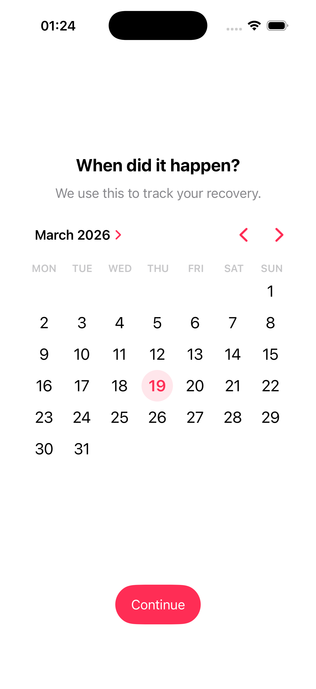 | 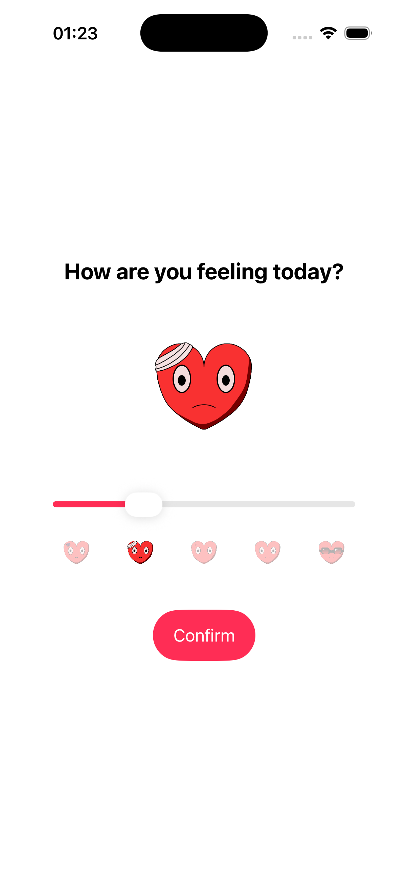 | 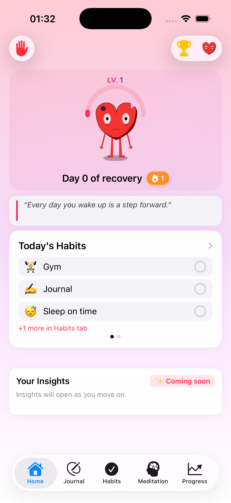 | 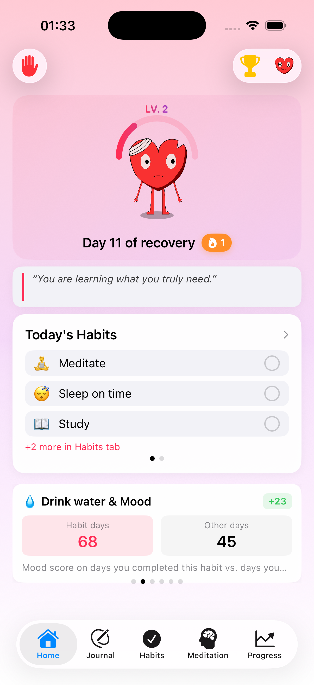 |

| Seviye 3 | Seviye 4 | Seviye 5 |
|:-------:|:-------:|:-------:|
| 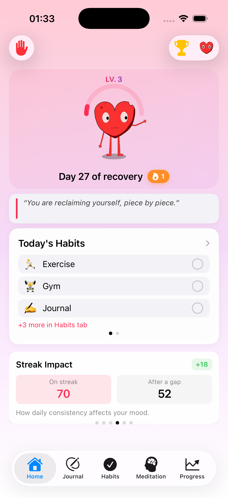 | 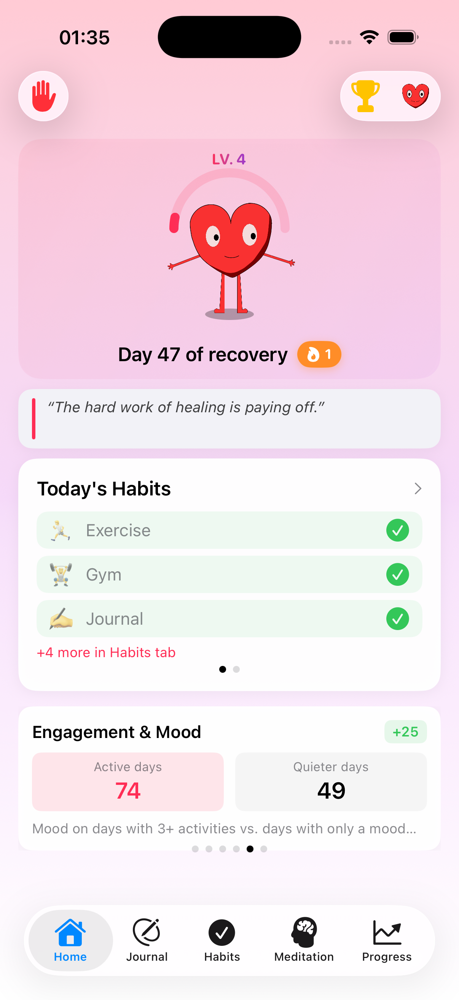 | 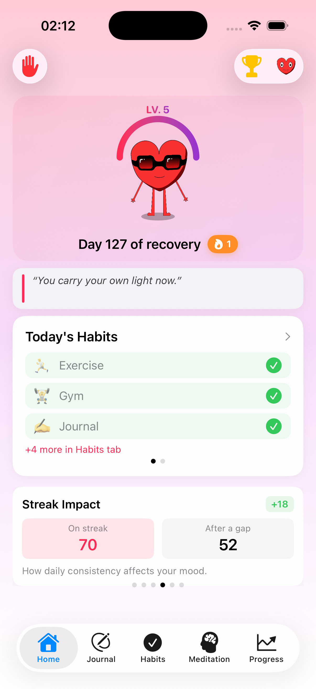 |

### Temel Özellikler

| Günlük | Alışkanlıklar | Meditasyon | İlerleme |
|:-------:|:------:|:----------:|:--------:|
| 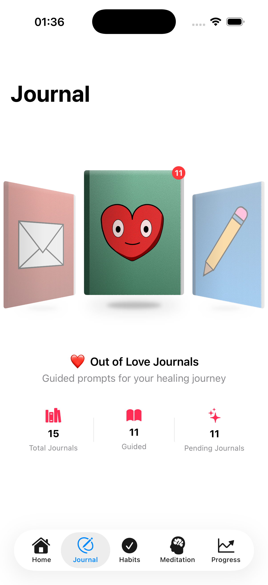 | 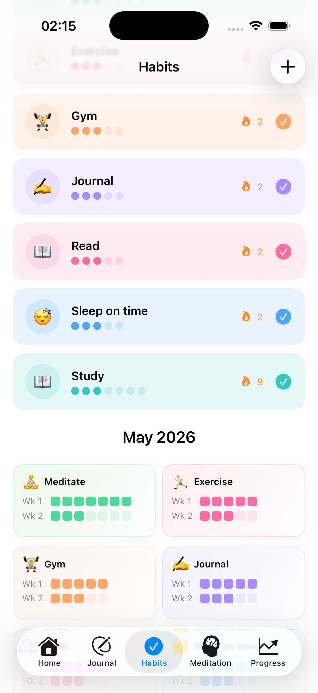 | 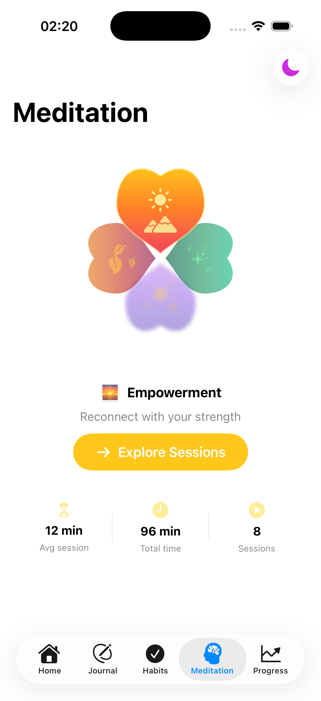 | 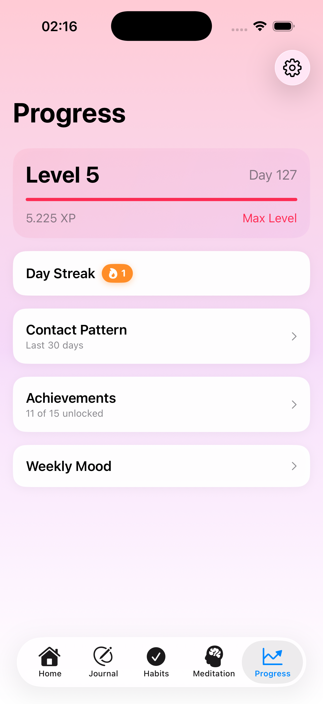 |

### No Contact Akışı

| Mini Oyun Seçimi | Nefes Egzersizi | Stres Tıklama | Balon Patlatma |
|:----------:|:---------:|:----------:|:---------------:|
| 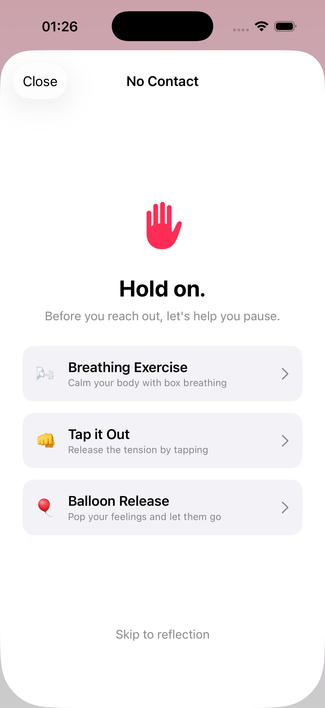 | 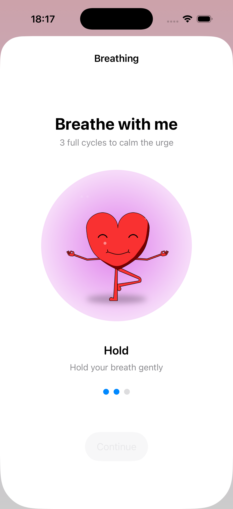 | 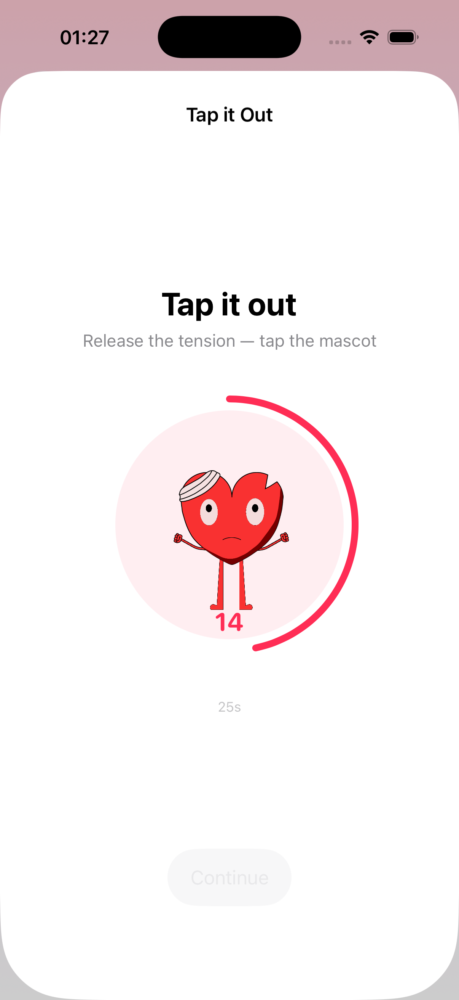 | 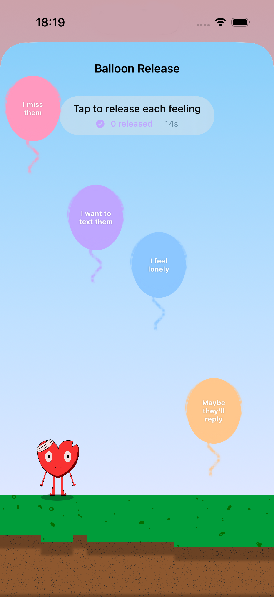 |

| Gerçeklik Kontrolü | Öz-Yansıtma | Seviye Atlama |
|:-------------:|:---------------:|:--------:|
| 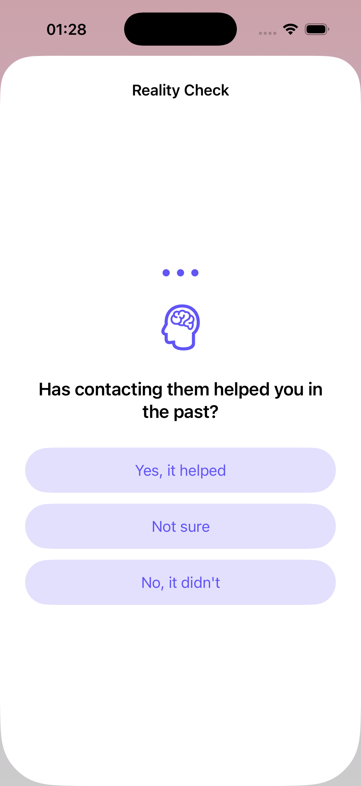 | 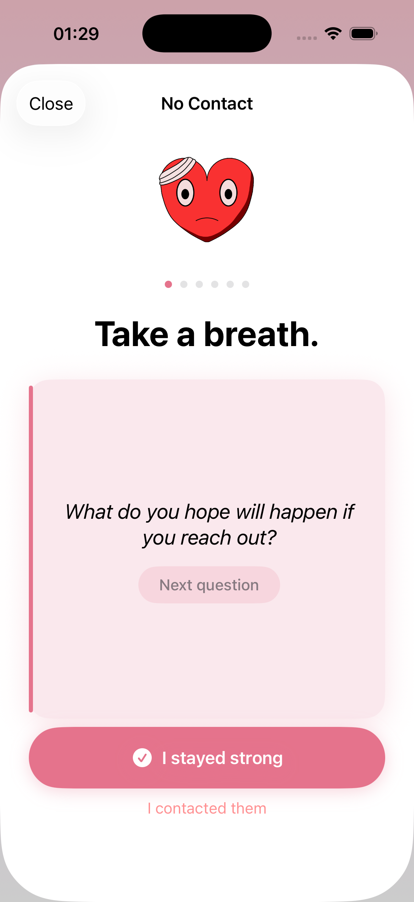 | 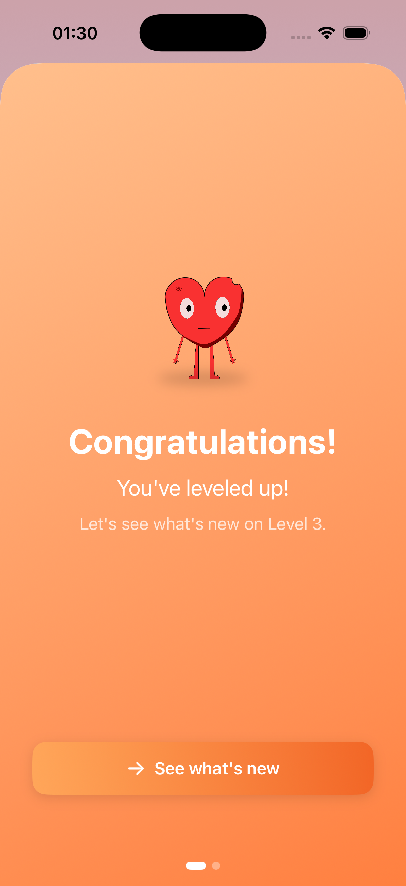 |

---

## ✨ Özellikler

- **XP ve Seviye Sistemi** — Günlük anlamlı eylemlerle deneyim puanı kazan. Seviye ilerlemesi hem XP hem de gerçek geçen gün sayısına bağlıdır; ani ödül beklentisi engellenir.
- **Ruh Hali Takibi** — Her gün ruh halini kaydet, son 7 günün görsel geçmişini takip et.
- **3 Kategorili Günlük** — Serbest yaz (Kişisel), gönderilmeyecek mektuplar yaz (Mektup) ya da yapılandırılmış sorularla ilerle (Rehberli). Kısa giriş +20 XP, uzun giriş +30 XP kazandırır.
- **Alışkanlık Takibi** — Haftalık limitli özel alışkanlıklar tanımla. Tamamlama serisi aylık ızgara görünümüyle izlenir.
- **Rehberli Meditasyon** — 4 kategoride 12 oturum: *Özlemek*, *Ayrılığı İşlemek*, *Güçlenme* ve *Günlük Rutin*. Maskot, nefes döngüsüyle senkronize animasyon gösterir.
- **No Contact Modülü** — Eski partnere ulaşma dürtüsü hissedildiğinde 3 aşamalı müdahale akışı devreye girer:
  1. Mini oyun seç (Nefes / Stres Tıklama / Balon Patlatma)
  2. Gerçeklik kontrolünü tamamla (risk puanı hesaplanır)
  3. 6 öz-yansıtma kartını kart kaydırma ile geç
- **Recovery Tasks** — 5 zorluk seviyesinde 3 günlük süreli görevler. Durum makinesi: Beklemede → Aktif → Soğuma → Süresi Dolmuş.
- **Rozet Sistemi** — Seriler, kilometre taşları ve modül kullanımına bağlı 15 kazanılabilir başarı.
- **Haftalık Özet** — Haftanın ruh hali, aktivite ve XP kazanımının özeti.
- **Lottie Maskot** — 5 seviye × 5 kategori kombinasyonunda 25 animasyonlu kalp karakteri; iyileştikçe görsel olarak evriliyor.

---

## 🏗️ Mimari

Uygulama katı bir **4 katmanlı MVVM** mimarisi üzerine inşa edilmiştir:

```
┌──────────────────────────────────────────┐
│       Katman 1 — View (SwiftUI)          │
│   30+ görünüm · İş mantığı yok          │
├──────────────────────────────────────────┤
│    Katman 2 — ViewModel (@Observable)    │
│   12 ViewModel · Reaktif durum yönetimi  │
├──────────────────────────────────────────┤
│          Katman 3 — Service              │
│  XPManager · TaskManager · BadgeManager  │
│  NotificationManager · HapticManager     │
├──────────────────────────────────────────┤
│       Katman 4 — Model (SwiftData)       │
│  UserProgress · JournalEntry · Habit     │
│  ContactEvent                            │
└──────────────────────────────────────────┘
```

`HomeViewModel` merkezi koordinatör rolündedir; tüm alt ViewModel'leri barındırır ve `AppRouterView` aracılığıyla global modal akışlarını yönetir.

---

## 🛠️ Kullanılan Teknolojiler

| Katman | Teknoloji |
|--------|-----------|
| Dil | Swift 5.9+ |
| UI Çerçevesi | SwiftUI |
| Mimari | MVVM + `@Observable` (iOS 17) |
| Kalıcı Depolama | SwiftData |
| Animasyon | Lottie (Swift Package Manager) |
| Ses | AVFoundation |
| Dokunsal Geri Bildirim | Core Haptics |
| Bildirim | UserNotifications |
| Hafif Depolama | UserDefaults |
| IDE | Xcode 16+ |
| Hedef Platform | iOS 17.0+ |

---

## 🧠 Tasarım Gerekçeleri

### No Contact Mini Oyunları
Her mini oyun farklı bir düzenleyici stratejiyi hedefler:
- **Nefes Egzersizi** — Diyafragmatik nefes ile fizyolojik düzenleme; parasempatik sinir sistemini aktive eder *(Arch & Craske, 2006)*
- **Stres Tıklama** — Motor aktiviteyle somatik boşalma; kontrol duygusu yaşatır *(König vd., 2019)*
- **Balon Patlatma** — Duygu etiketleme (affect labeling) yoluyla bilişsel tanıma; amigdala aktivitesini düşürür *(Lieberman vd., 2007)*

### Rehberli Günlük Promtları
Yapılandırılmış sorular 5 seviyede kademeli derinleşir; yüzeysel duygusal farkındalıktan (Seviye 1) bütüncül öz-değerlendirmeye (Seviye 5) uzanır. *(Pennebaker & Beall, 1986)*

### Recovery Tasks
Görevler 5 iyileşme fazında yapılandırılmıştır: Duygusal Kabul → Farkındalık → Öz-Bakım → Büyüme → Sosyal Genişleme. Davranışsal Aktivasyon ilkeleri *(Papa vd., 2013)* ve Bandura'nın öz-yeterlik kuramı *(1977)* ile uyumludur.

> ⚠️ Bu uygulama profesyonel psikolojik danışmanlık veya terapi hizmetinin **yerini tutmaz**. Yalnızca kişisel gelişim ve öz-yansıtma aracı olarak tasarlanmıştır.

---

## 🔄 Geliştirme Süreci

**İteratif ve Artımlı Geliştirme** modeli benimsenerek 6 iterasyonda tamamlanmıştır:

| İterasyon | Kapsam |
|-----------|--------|
| 1 | Çekirdek mimari — AppRouterView, MVVM katmanları, XPManager, SwiftData kurulumu |
| 2 | HomeView, ruh hali takibi, günlük sistemi |
| 3 | Alışkanlık modülü, görev sistemi (TaskManager), rozet sistemi |
| 4 | Meditasyon modülü, No Contact akışı, nefes egzersizi |
| 5 | Lottie maskot sistemi (25 animasyon), XP popup, LevelUpView |
| 6 | Haftalık özet, bildirimler, DebugView, UX iyileştirmeleri |

---

## 📊 Proje İstatistikleri

- **67** Swift kaynak dosyası
- **~16.000** satır kod
- **30+** SwiftUI görünümü
- **12** ViewModel
- **11** Servis
- **25** Lottie animasyon dosyası
- **5** Seviye × **5** Kategori maskot sistemi
- **15** Kazanılabilir rozet
- **12** Rehberli meditasyon oturumu

---

## 📄 Lisans

Bu proje **OSTİM Teknik Üniversitesi** Yazılım Mühendisliği Bölümü lisans bitirme projesi olarak geliştirilmiştir (Mayıs 2026).

Kaynak kod paylaşılmamaktadır.

---

*— [Beray Seber](mailto:berayseber@gmail.com)*
